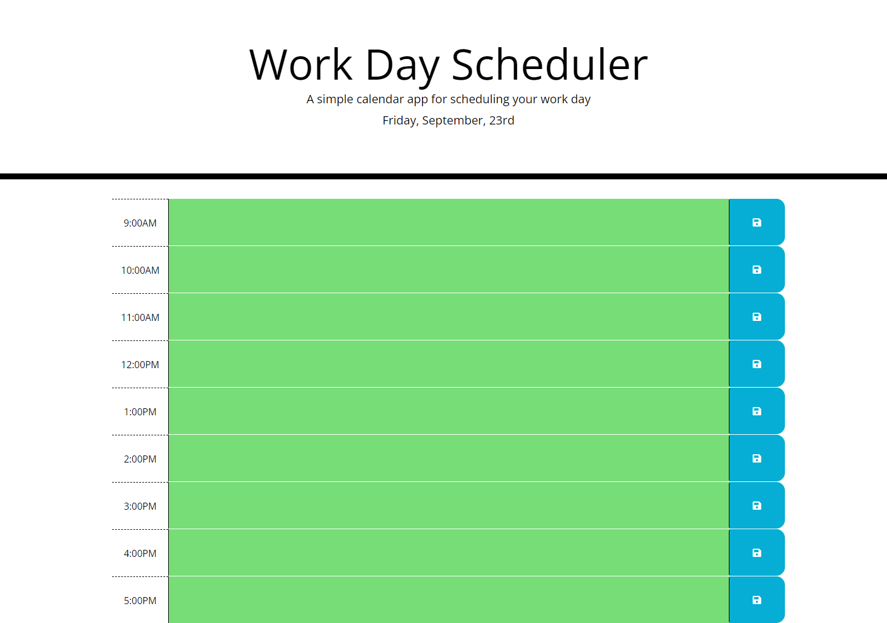

# Work-Day-Scheduler


## Description

- The motivation behind this project was to create a simple calendar application that allows a user to save events for each hour of the day by modifying starter code. The app is runing in the browser and feature dynamically updated HTML and CSS powered by jQuery.

- This project was built to demostrate jQuery skills acquired in class by creating a simple calendar that save event for each hour of the day. 

- The project eleminates the problems of having overlapping events by making planning events simple. 

- While creating this project, I learned how to implement third party APIs such as JQuery elements, click events, form elemets, moment.js, DOM-Traversal, JWuery-Ui widgets and interactions. 

---
## Link To Deployed Webpage
 https://eugeneisingizwe.github.io/Work-Day-Scheduler/

## Webpage Screenshoot

The following animation demonstrates the application functionality:


## User Story

```md
AS AN employee with a busy schedule
I WANT to add important events to a daily planner
SO THAT I can manage my time effectively
```

## Acceptance Criteria

```md
GIVEN I am using a daily planner to create a schedule
WHEN I open the planner
THEN the current day is displayed at the top of the calendar
WHEN I scroll down
THEN I am presented with timeblocks for standard business hours
WHEN I view the timeblocks for that day
THEN each timeblock is color coded to indicate whether it is in the past, present, or future
WHEN I click into a timeblock
THEN I can enter an event
WHEN I click the save button for that timeblock
THEN the text for that event is saved in local storage
WHEN I refresh the page
THEN the saved events persist
```

© 2022 Trilogy Education Services, LLC, a 2U, Inc. brand. Confidential and Proprietary. All Rights Reserved.
